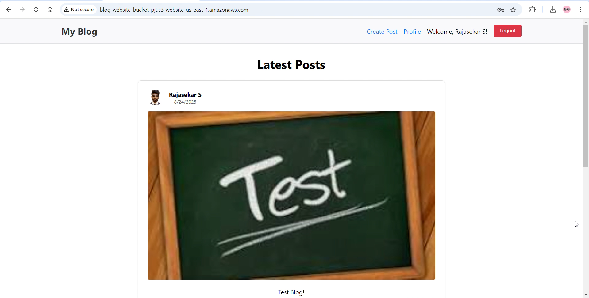
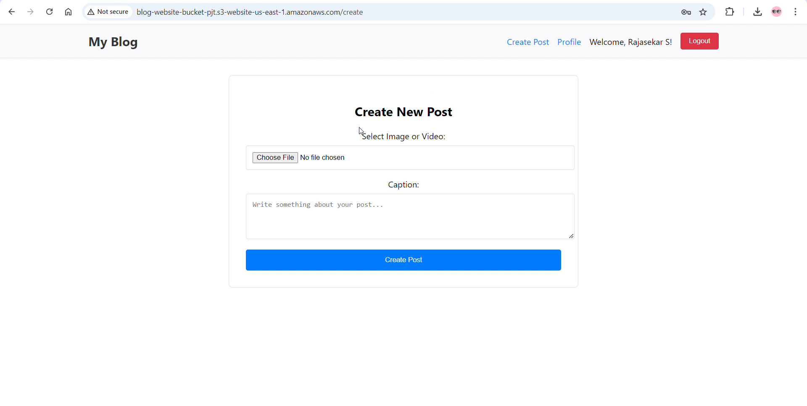
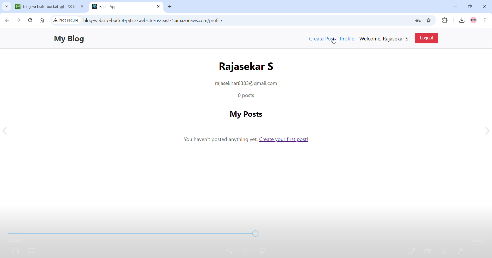

# AWS Blog Website

A full-stack blog application built with React and Node.js, deployed on AWS using various cloud services. Users can sign up, create blog posts with images/videos, and share their content with others.


## 🚀 Features

- **User Authentication**: Secure signup/signin with JWT tokens
- **Profile Management**: Users can upload profile photos
- **Blog Posts**: Create posts with images or videos and captions
- **Public Feed**: All posts are visible to everyone with the link
- **Responsive Design**: Works seamlessly on desktop and mobile devices
- **Cloud Storage**: Media files stored securely in AWS S3
- **Scalable Architecture**: Built using AWS best practices

## 🏗️ Architecture

The application uses a modern cloud-native architecture:

- **Frontend**: React.js (TypeScript) hosted on AWS S3 + CloudFront
- **Backend**: Node.js Express API running on AWS EC2
- **Database**: MySQL on AWS RDS
- **File Storage**: AWS S3 for images and videos
- **Infrastructure**: Custom VPC with public/private subnets
- **Authentication**: JWT-based authentication system

## 📁 Project Structure

```
aws-blog-site/
├── frontend/                          # React frontend application
│   ├── public/                        # Static files
│   │   ├── index.html
│   │   ├── favicon.ico
│   │   └── manifest.json
│   ├── src/                           # Source code
│   │   ├── components/                # Reusable components
│   │   │   └── Navbar.tsx
│   │   ├── contexts/                  # React contexts
│   │   │   └── AuthContext.tsx        # Authentication context
│   │   ├── pages/                     # Page components
│   │   │   ├── Home.tsx               # Homepage with all posts
│   │   │   ├── Login.tsx              # User login page
│   │   │   ├── Register.tsx           # User registration page
│   │   │   ├── CreatePost.tsx         # Create new blog post
│   │   │   └── Profile.tsx            # User profile page
│   │   ├── App.tsx                    # Main app component
│   │   ├── App.css                    # Global styles
│   │   └── index.tsx                  # App entry point
│   ├── package.json                   # Dependencies and scripts
│   ├── tsconfig.json                  # TypeScript configuration
│   └── .env                           # Environment variables (not in repo)
├── backend/                           # Node.js backend API
│   ├── config/                        # Configuration files
│   │   ├── database.js                # Database connection and setup
│   │   └── aws.js                     # AWS S3 configuration
│   ├── middleware/                    # Express middleware
│   │   └── auth.js                    # JWT authentication middleware
│   ├── routes/                        # API routes
│   │   ├── auth.js                    # Authentication endpoints
│   │   └── blog.js                    # Blog post endpoints
│   ├── server.js                      # Main server file
│   ├── package.json                   # Dependencies and scripts
│   ├── test-db.js                     # Database connection test (optional)
│   └── .env                           # Environment variables (not in repo)
```

## 🛠️ Technology Stack

### Frontend
- **React 18** with TypeScript
- **React Router** for navigation
- **Axios** for API calls
- **Context API** for state management

### Backend
- **Node.js** with Express.js
- **MySQL2** for database operations
- **JWT** for authentication
- **Bcrypt** for password hashing
- **Multer** for file uploads
- **AWS SDK** for S3 operations
- **PM2** for process management

### AWS Services
- **EC2** - Application hosting
- **RDS MySQL** - Database
- **S3** - File storage and static website hosting
- **CloudFront** - Content delivery network (optional)
- **VPC** - Network infrastructure
- **IAM** - Access management

## 🚀 Quick Start

### Prerequisites

- AWS Account with free tier access
- Node.js 18+ installed locally
- Git installed
- AWS CLI configured

### 1. Clone the Repository

```bash
git clone https://github.com/raja1809/aws-blog-site.git
cd aws-blog-site
```

### 2. Set Up AWS Infrastructure

Follow the detailed setup guide in `DEPLOYMENT.md` or use the setup script:


### 3. Configure Environment Variables

**Backend (.env)**:
```env
DB_HOST=your-rds-endpoint.region.rds.amazonaws.com
DB_USER=admin
DB_PASSWORD=your-secure-password
DB_NAME=blogapp
JWT_SECRET=your-super-secret-jwt-key-minimum-32-characters
AWS_REGION=us-east-1
S3_BUCKET_NAME=your-unique-bucket-name
PORT=3001
```

**Frontend (.env)**:
```env
REACT_APP_API_URL=http://your-ec2-ip:3001/api
```

### 4. Install Dependencies

```bash
# Backend
cd backend
npm install

# Frontend
cd ../frontend
npm install
```

### 5. Deploy to AWS

```bash
# Deploy backend to EC2
scp -i your-key.pem -r backend/ ec2-user@your-ec2-ip:~/
ssh -i your-key.pem ec2-user@your-ec2-ip
cd backend && npm install
pm2 start server.js --name blog-backend

# Build and deploy frontend to S3
cd frontend
npm run build
aws s3 sync build/ s3://your-website-bucket --delete
```

## 📚 API Documentation

### Authentication Endpoints

- `POST /api/auth/register` - Register new user
- `POST /api/auth/login` - User login
- `GET /api/auth/me` - Get current user info

### Blog Endpoints

- `GET /api/blog/posts` - Get all posts
- `POST /api/blog/posts` - Create new post (authenticated)
- `GET /api/blog/posts/user/:userId` - Get posts by user


## 📸 Screenshots

### Homepage



### Create Post


### User Profile


## 🔒 Security Features

- **JWT Authentication** with secure token handling
- **Password Hashing** using bcrypt
- **CORS Protection** configured for specific origins
- **Input Validation** on both frontend and backend
- **VPC Network Isolation** for database security
- **IAM Roles** with minimal required permissions

## 🧪 Testing

```bash
# Backend tests
cd backend
npm test

# Frontend tests
cd frontend
npm test

# Test database connection
node test-db.js
```


## 💰 Cost Estimation

Using AWS Free Tier:
- **EC2 t2.micro**: Free for 750 hours/month
- **RDS db.t3.micro**: Free for 750 hours/month
- **S3 Storage**: 5GB free
- **Data Transfer**: 1GB/month free


## 🆘 Troubleshooting

### Common Issues

1. **Database Connection Failed**
   - Check RDS security group allows connections from EC2
   - Verify RDS endpoint in .env file
   - Ensure EC2 and RDS are in the same VPC

2. **File Upload Errors**
   - Verify IAM role attached to EC2 instance
   - Check S3 bucket policy allows uploads
   - Confirm bucket name is correct in .env

3. **CORS Errors**
   - Update backend CORS configuration
   - Check frontend API URL is correct
   - Verify EC2 security group allows port 3001


**Made with ❤️ by [Raja]**

*If you found this project helpful, please give it a ⭐ on GitHub!*